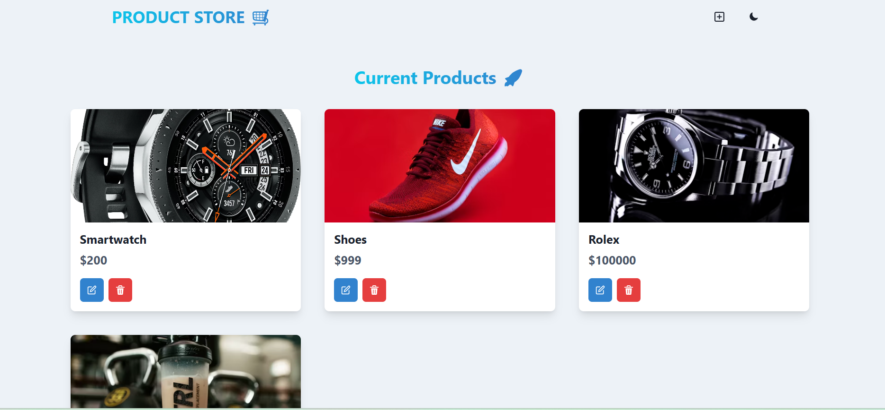

# Project Title

Product Store:- Streamlined Product Management Interface.

# Project Description 

The Product Store Interface is an online platform designed to simplify the process of adding and managing products in an e-commerce store. Users can seamlessly add product images, names, and prices through an intuitive user interface. The system allows for easy editing and deletion of product entries, ensuring that the product catalog is always up-to-date.

# Key Features 

1. Product Addition: Users can add new products by uploading an image, entering the product name, and setting the price.

2. Product Display: Each product entry displays an image, the product name, and the price.

3. Edit Functionality: Users can easily edit the details of existing products using the pencil icon.

4. Delete Functionality: Users can remove products from the catalog by clicking the trash can icon.

5. User Interface: The interface includes a header with the title "PRODUCT STORE" and a shopping cart icon, creating a clear and user-friendly navigation experience.

6. Current Products Section: This section lists all the products currently in the store, along with options to edit or delete each product.

7. Night Mode: A toggle option for night mode, enhancing user comfort during night-time browsing.

8. Add New Product Icon: An icon for quickly adding new products, streamlining the product management process.

# Tech Stack 

Frontend: Developed a frontend using the React JS and Chakra UI.

Backend: For the backend used the Node JS and Express JS.

Database: Utilizes a database management system like MongoDB to store the information of the product.

# Installation 

### Setup .env file

```shell
MONGO_URI=your_mongo_uri
PORT=5000
```

### Run this app locally

```shell
npm run build
```

### Start the app

```shell
npm run start
```

# Project Screenshot 



